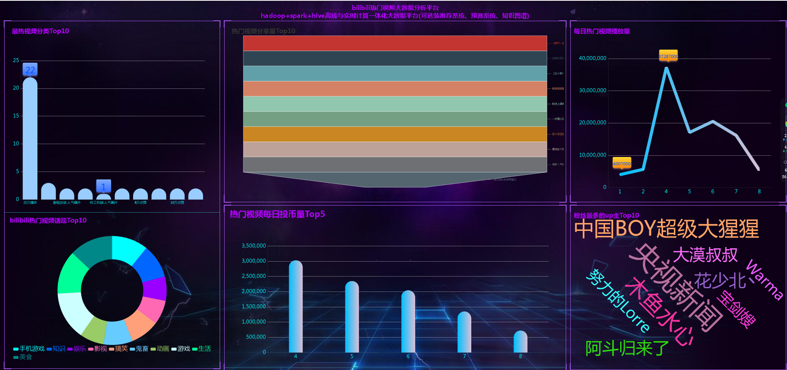

## 计算机毕业设计吊打导师hadoop+spark+hive知识图谱bilibili视频数据分析可视化大屏 视频推荐系统 预测系统 实时计算 离线计算 数据仓库 人工智能 神经网络

## 要求
### 源码有偿！一套(论文 PPT 源码+sql脚本+教程)

### 
### 加好友前帮忙start一下，并备注github有偿hive视频
### 我的QQ号是2827724252或者798059319或者 1679232425或者微信:bysj2023nb

# 

### 加qq好友说明（被部分 网友整得心力交瘁）：
    1.加好友务必按照格式备注
    2.避免浪费各自的时间！
    3.当“客服”不容易，repo 主是体面人，不爆粗，性格好，文明人。

基础版，也就是当前下面连接这个版本(只带hadoop spark hive flask selenium echarts大屏可视化驾驶舱)

https://www.bilibili.com/video/BV178411R7ZJ/?spm_id_from=333.999.0.0

## 开发技术：
spark hadoop hive selenium爬虫 flask echarts
## 创新点：
1、显摆hive+hadoop离线计算、spark实时计算全部实现，防止导师喷你只有离线计算或者实时计算。
2、爬虫采集海量每日真实视频数据。
3、flask+echarts可视化大屏高端大气上档次。

如果他(导师)还是狂喷不止，继续选择以下的系统，他们可以选装牛鼻功能！

## 可选装项目模块如下：
1.推荐系统(4种深度学习推荐算法 协同过滤基于用户 基于物品 SVD神经网络 MLP)。附带AI、支付、短信、lstm情感分析。
2.预测系统(KNN CNN RNN卷积神经预测 K-means 线性回归)。
3.知识图谱neo4j可视化关系网络图。
4.后台管理系统。

注意：以上1234部分均采用springboot+vue.js前后端分离架构！！！
选装视频效果如下：
https://www.bilibili.com/video/BV1Lz4y1p7Bt/?spm_id_from=333.999.0.0
https://www.bilibili.com/video/BV1A14y1m7xo/?spm_id_from=333.999.0.0

# 运行视频(B站)

简易

https://www.bilibili.com/video/BV18m4y1e7Pj/?spm_id_from=333.999.0.0

详细

https://www.bilibili.com/video/BV1qX4y1i7tX/?spm_id_from=333.999.0.0

